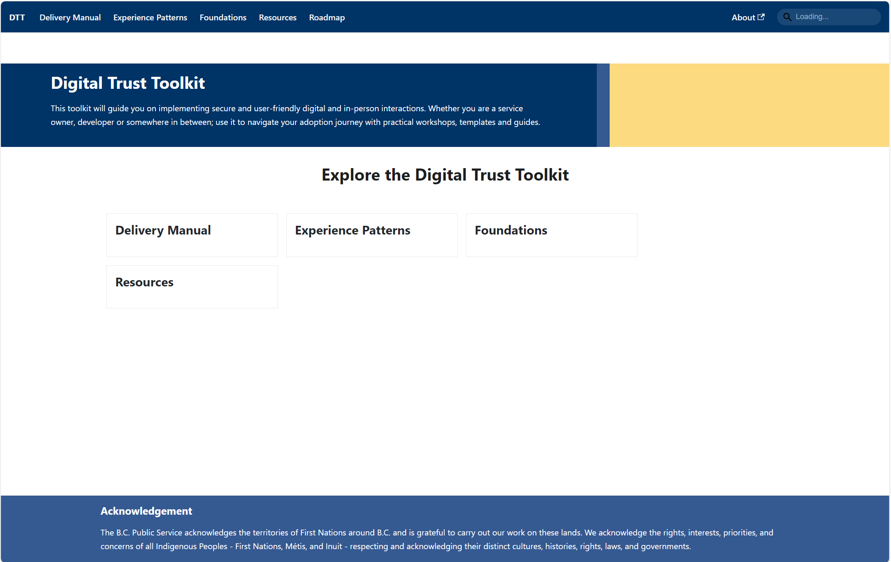

# Website

This website is built using [Docusaurus](https://docusaurus.io/), a modern static website generator.

### Installation

```
$ npm run
```

### Local Development

```
$ npm run start
```

This command starts a local development server and opens up a browser window. Most changes are reflected live without having to restart the server.

### Build

```
$ npm run build
```

This command generates static content into the `build` directory and can be served using any static contents hosting service.

<!-- GitHub Actions have been set up for this therefore using the CLI is discouraged -->
<!-- ### Deployment

Using SSH:

```
$ USE_SSH=true npm run deploy
```

Not using SSH:

```
$ GIT_USER=<Your GitHub username> npm run deploy
```

If you are using GitHub pages for hosting, this command is a convenient way to build the website and push to the `gh-pages` branch. -->


### Autogenerating Links

This site is configured to automatically generate the navbar and main page links based on the top-level folders in the `docs` directory. To ensure that the links render correctly, each folder must have an `index.md` file. Alternatively, you can use `_index.md` (with an underscore) to prevent Docusaurus from rendering the markdown.

For example, consider the following directory structure in `docs`:

```
docs
├── delivery-manual
│   └── index.md
├── experience-patterns
│   └── index.md
├── foundations
│   └── index.md
└── resources
    ├── index.md
```

Based on this structure, the following navbar and main page links will be generated:



To add another link to the navbar and main page, simply create a new folder in the `docs` directory with an index file. The new link will be automatically generated.

_NOTE: If the links on the website do not update immediately, you can try stopping the development server then restarting it with `npm run start`. Alternatively, you can rebuild the documentation by running `npm run build`._

#### Ordering

You can customize the ordering of the links by adding an `order` property in the front matter of the index files:

```yaml
---
order: 1
---
```

For example, if you want the links to appear in the following order:

1. Foundations
2. Experience Patterns
3. Delivery Manual
4. Resources

You would add the front matter accordingly to the index files. The links will be displayed in ascending order. Index files without an order property will appear alphabetically after the ordered links. If multiple index files have the same order, they will be sorted alphabetically in place.

#### Main page link descriptions

You can further add a `description` to the front matter of the index files, and the main links will display it:

```yaml
---
description: This is a description
---
```

In the following example, links have a custom order and have descriptions applied to them:


