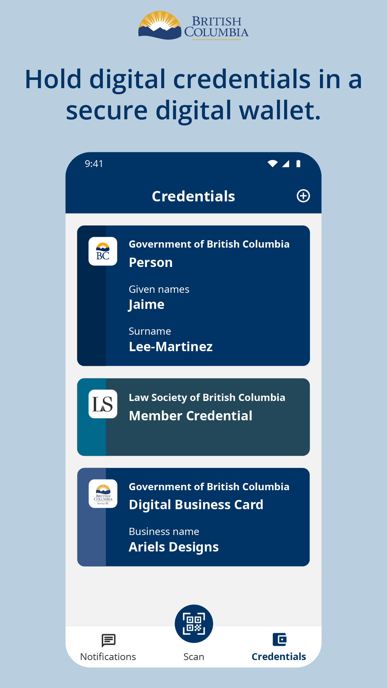

## The Challenge: Evolving Cybersecurity Threats
Digital transformation continues to improve our lives as new digital solutions save people time and money in day-to-day interactions. However, with an increased dependence on digital solutions comes a greater exposure to continuously evolving cyber threats.

> In 2022, 7 in 10 Canadians (70%) experienced a cybersecurity incident, up from 58% in 2020.
> — [Statistics Canada, 2024](https://www.statcan.gc.ca/o1/en/plus/5527-safely-navigating-cyberspace)

As cyber attacks become more frequent and sophisticated, we need to consider new ways to secure the data of people and organizations and build a better digital future.

### Symptoms of Cyber-Insecurity
We can diagnose cyber-insecurity through various common symptoms, including an uptick in phishing, identity theft, spyware and ransomware incidents.

- **Phishing**: a social engineering method used to capture personal and/or financial information.
- **Identity Theft**: Fraudulent acquisition and use of a person’s private identifying information, usually for financial again.
- **Spyware:** Malware that can monitor and control the activity of a device without the user’s permission.
- **Ransomware**: Malware that infects a computer, network or IoT devices and spreads rapidly to encrypt the data for extortion purposes.

### Causes of Cyber-Insecurity
If we want to effectively address the vulnerability to cybersecurity threats, we need to address the root causes of cybersecurity.

**Username and password** combinations are not a reliable security gate for digital identity solutions. Passwords are often weak, guessable and reused across platforms, making connected accounts an easy target. With the rising prevalence of phishing and similar scams, even careful users can fall victim to a breach. While Multi-Factor-Authentication (MFA) offer some phishing resistance, it diminishes user experience.

**Single Sign-On** (SSO) approaches are user-friendly, by simplifying access to a variety of services, but come at the expense of introducing a single point of failure. If the SSO credentials are compromised, a malicious actor gains access to all authorized accounts and services.

## Leaving usernames & passwords behind

As we take steps toward a better digital future, we evolve from username-password combinations and Single Sign-On (SSO) models, embracing digital trust technology for a more secure way to store and share information digitally.

## What is Digital Trust
Digital trust is all about providing secure and privacy-preserving ways for people and organizations to share things and communicate online.

As people and organizations want to accomplish more online, the exposure to continuously evolving cybersecurity threats grows. We need to keep improving our tools and solutions to counter current and future threats and help safeguard sensitive information.

Digital trust goes beyond providing secure access and identity verification. It also covers:

- Encrypted, private messaging
- Ongoing, confidential relationships and data exchange
- Filling in and signing things digitally, in a secure and authentic way

## Benefits of Digital Trust
There are many benefits to using digital trust technology, including:

- **Confidentiality**: Connecting organizations and individuals directly and securely.​
- **Authenticity**: Determining that data is unchanged and comes from a trusted source.​
- **Privacy**: Empowering individuals and organizations to only share the info​ they choose.​
- **Efficiency**: Saving time and resources for individuals and organizations by simplifying processes.​

> Use the ideation workshop activity to explore use cases for digital trust that are relevant to your particular service area.
