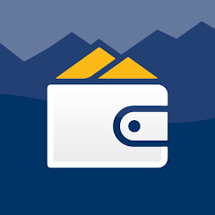

There are several technical tools that help make digital trust a reality.

## BC Wallet

[BC Wallet](https://www2.gov.bc.ca/gov/content/governments/government-id/bc-wallet#get) is an app for mobile devices that stores digital credentials in a secure and privacy preserving way. Held in BC Wallet, digital credentials can be used to prove something about a user or their business to other individuals or public and private organizations.   

There are two main components, both under the [OpenWallet Foundation](https://openwallet.foundation/), that are powering the BC Wallet.

### Bifold
Bifold is designed to enhance interactions with digital identities, and make the process both secure and user-friendly.

#### Relevant Links
- [GitHub](https://github.com/openwallet-foundation/bifold-wallet)
- [Community](https://discord.gg/openwalletfoundation)
- [Wiki](https://wiki.openwallet.foundation/display/BIFOLD/)

### Credo
Credo is designed to make building self-sovereign identity solutions easy and straightforward.

#### Relevant Links
- [GitHub](https://github.com/openwallet-foundation/credo-ts)​
- [Working Group](https://github.com/openwallet-foundation/credo-ts/wiki/Meeting-Information)​
- [Wiki](https://github.com/openwallet-foundation/credo-ts/wikihttps://github.com/openwallet-foundation/credo-ts/wiki)

### **Traction**

[Traction](https://github.com/bcgov/traction) is designed with an API-first architecture layered on top of Hyperledger Aries Cloud Agent Python ([ACA-Py](https://github.com/hyperledger/aries-cloudagent-python)) and streamlines the process of sending and receiving digital credentials for governments and organizations, offering​:

- Enhanced interoperability​
- Multi-tenant capacity​
- Safer data exchange

#### Resources
- [Traction GitHub Repository](https://github.com/bcgov/traction): Learn how to start using Traction.

Establish your own Traction tenant in a B.C. Government sandbox to issue,​ hold, present and verify digital credentials with a dedicated workshop.​

>Try out the [Traction Sandbox](https://github.com/bcgov/traction/blob/main/docs/traction-anoncreds-workshop.md).
