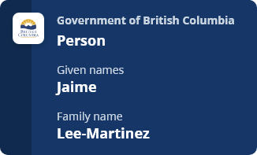
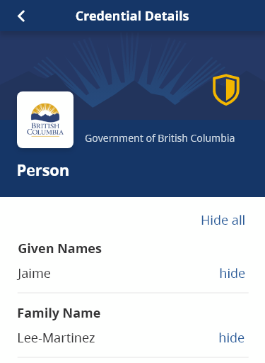

# UX Guide for Credentials & Connections

# Table of Contents

 - [Overview](#overview)
 - [BC Wallet – Current and Future Implementations](#bcwallet)
 - [Credential](#credential)
 - [Connection Name](#connectionname)

  
 # Overview
This guide is intended to ensure the credentials issued by the BC Government, or issued using BC Government infrastructure such as the CANdy ledger, are trusted and usable.
> **_MUST v SHOULD:_** This guide uses the terms “MUST” and “SHOULD” as defined in [Key words for use in RFCs to Indicate Requirement Levels](https://www.ietf.org/rfc/rfc2119.txt).

***Note**: this guide concerns how a credential appears in the BC Wallet, not the design of the credential’s schema*

| Goals | Approach to Meeting Goals |
| ----------- | ----------- |
| 1. Encourage holders and issuers to value the credentials they are issued 2. Help holders to use their credentials and get support when needed 3. Help holders to interact with their contacts | 1. Consistency between credentials 2. Clear information in credentials and connections (aka, contacts) 3. Emphasizing the authority that issued a credential 4. Making it easy to connect with the service within an issuer that can provide information and assistance 5. Enable issuers to work with the credential template and understand how their credential will be presented in the BC Wallet app |

# BC Wallet – Current and Future Implementations
This guide is written to optimize how credentials will be presented in the BC Wallet app, which operates on mobile devices such as phones and tablets. The BC Wallet was first released in 2022, is evolving in response to user feedback, and is gradually adding support for [Overlays Capture Architecture (OCA) For Aries](https://github.com/swcurran/aries-rfcs/tree/oca4aries/features/0755-oca-for-aries). 

This guide is designed to help credential issuers take advantage of current BC Wallet functionality. They also aim to help issuers “future proof” their credential by providing guidance for OCA features that are expected to be supported by BC Wallet in the near future, and guidance to not use some aspects of OCA where future BC Wallet implementation is undefined.

# Credential
The BC Wallet presents credentials using a common template that is tailored to the specific credential based on:
- The credential’s data
- The OCA (Overlay Capture Architecture) bundle specified for the credential. The elements of the credential – e.g., its colour, logo, name, attribute names – are defined in various “overlays”. Guidance for the content of the OCA bundle for BC Government credentials are specified in this section.

*Example Credential - Simple View*  

*Credential - Detail View (top)*  

For more details on OCA bundle, see:
- [Overlays Capture Architecture (OCA) For Aries](https://github.com/swcurran/aries-rfcs/tree/oca4aries/features/0755-oca-for-aries)
- [OCA for Aries Style Guide](https://github.com/swcurran/aries-rfcs/tree/oca4aries/features/0756-oca-for-aries-style-guide)
- [Credential Designs design guide](https://xd.adobe.com/view/045a1969-719a-4aa5-848f-637ef1b7051a-5109/)
- [BC Government OCA bundles](https://github.com/bcgov/aries-oca-bundles/tree/main/OCABundles/schema/bcgov-digital-trust)

## Credential Meta Information
The Meta Overlay data in the OCA file describes the schema to the wallet, which may then present this information to the holder in offers, proof requests, and when viewing the credentials in the wallet. Meta Overlay attribute names are are identified in OCA documentation with OL-MN and OL-MV.

| Meta Overlay | Description | BC Wallet | Guidance |
| ----------- | ----------- | ----------- | ----------- |
| name | The name of the credential | Shown on card view | - MUST have a value  - The name of the credential  - Should be short – 1-3 words  - Should be the name of the Schema on the ledger  - Examples: Person, Digital Business Card |
| description | A plain language definition of the credential | *Not used* | - MUST have a value   -- *Include in anticipation of when BC Wallet uses this attribute*  - A description of the credential  - Should be short – 10-20 words  - Should reflect the subject/topic of the credential, i.e., what the credential attributes describe |
| issuer | The name of the organization that issues the credential | Shown on card view | - MUST have a value  - The name of the issuer of the credential  - Should be the legal name of the organization, not a department or branch within the organization  -- For credentials issued directly by the BC Government, this MUST be “Government of British Columbia”, unless a legislated role (or similar) is more appropriate  -- For credentials issued by crown corporations, this MUST be the name of corporation, e.g., for BC Hydro, this should be “British Columbia Hydro and Power Authority“ |
| issuer_description | A description for the issuer of the credential | *Not used* | - *This should be left blank until how it is used by the BC Wallet is defined* |
| issuer_url | A URL for the issuer of the credentialA URL for the issuer of the credential | *Not used* | - *This should be left blank until how it is used by the BC Wallet is defined* |
| credential_help_text | Help text that is presented to the user of the BC Wallet in the context of the credential  If credential_support_url is defined, this text will be a hyperlink or button that a person can tap, resulting in the web page referenced by  credential_support_url being opened on the device browser | *Not used* | - *Include in anticipation of when BC Wallet users this attribute*  - Should be concise and specific to the credential  - If it will present as a hyperlink, this should be short – 3-5 words and indicate where the URL goes (e.g., “Digital Business Card help page”) |
| credential_support_url | A link to a web page that has help information for users of the credential | *Not used* | - MUST have a value  -- *Include in anticipation of when BC Wallet users this attribute*  - URL for a service providing support in the use of the credential  - Should link to a support page maintained by the program area (possibly a division or branch within the issuing organization) responsible for the credential |

## Attributes – Labels & Information
Two Overlays in the credential’s OCA bundle define affect how the credential’s attributes – the individual data elements defined in the credential’s schema – may be presented in BC Wallet: 
- Label – the text appearing beside the attribute data
- Information – text that may be used to elaborate on the label *(not used by BC Wallet)*
### Attribute Labels
Attribute labels appear in credential offers, proof requests, and in the credential details screen of BC Wallet. In the example below, “Given Names” is the label of the credential attribute “given_names”, which has the value “Jamie”.

*Credential - Detail View (top)*  

Labels are defined in the Attribute Overlay and are identified in OCA documentation with OL-LA.Labels are defined in the Attribute Overlay and are identified in OCA documentation with OL-LA.

#### Guidance
- MUST be provided for each attribute in the credential
- Labels should be short – 1-3 words
- Labels should reflect the schema attribute name, e.g., “Given Names” for schema attribute “given_names”
- Labels should be consistent across credentials when those credentials have identical (or very similar) attributes, e.g, Date of Birth

### Attribute Information
*BC Wallet does not make use of this overlay but credentials should use it in anticipation of when BC Wallet does.*

Each attribute may include a plain language description of the schema attribute, to supplement the attribute’s label. In future, it may be supplement the labels that accompany each schema attribute with extra information that may be presented in, e.g., a tool tip.Each attribute may include a plain language description of the schema attribute, to supplement the attribute’s label. In future, it may be supplement the labels that accompany each schema attribute with extra information that may be presented in, e.g., a tool tip.

Attribute information is defined in the Information Overlay and are identified in OCA documentation with OL-IN.

#### Guidance
- SHOULD be provided for each attribute in the credential
- Should be short – 5-10 words
- Should reflect the formal definition of schema attribute, e.g., “The legal first name(s) of the person“ for schema attribute “given_names”

### Flagged Attributes
Attributes in a credential may be flagged as having sensitive data. In an OCA bundle, this is done in the [Capture Base](https://oca.colossi.network/v1.1.0-rc.html#capture-base) rather than in an [Overlay](https://oca.colossi.network/v1.1.0-rc.html#overlayshttps://oca.colossi.network/v1.1.0-rc.html#overlays).

When the BC Wallet receives a proof request that includes any of the credential’s flagged attributes, the BC Wallet will highlight those attributes to the credential holder to prompt them to consider whether they want to share the requested information.

This overlay is intended to be used sparingly and is not meant for all personally identifiable information. 

#### Guidance
- Attributes that contain personal information that would be sufficient to enable an individual to be uniquely identified without other information should be flagged:
    - Examples: Personal Health Number, Personal Education Number, Social Insurance Number, photo of the individual
- Attributes containing an individual’s date of birth should be flagged.
- The following personal data is also considered “sensitive” in most circumstances:
    - Personal data revealing racial or ethnic origin, political opinions, religious or philosophical beliefs
    - Trade-union membership
    - Genetic data, biometric data processed solely to identify a human being
    - Health-related data
    - Data concerning a person’s sex life or sexual orientation

### Watermark
Issuers can add a watermark to their credentials. The intention of this watermark is for issuers to mark non-production credentials so that users can distinguish between the production and non-production versions of the same credential.

#### Guidance
- Production credentials MUST NOT have a Watermark
- Credentials issued directly by BC Government MUST use a watermark to indicate if the credential is non-production, e.g.:
    - A credential used for testing purposes = TEST
    - A credential for demonstrative purposes = DEMO
- Watermarks should be a single short word

*Example non-production credential*  

### Unit Overlay
*BC Wallet does not currently make use of this overlay but may in the future.*

Allows the issuer to declare the unit of measurement for attributes in the overlay.

#### Guidance
- Credentials issued directly by BC Government should:
    - Always use metric units
- Credentials should follow B.C. Governments web style guide on [Writing numbers and dates in web content](https://www2.gov.bc.ca/gov/content/governments/services-for-government/service-experience-digital-delivery/web-content-development-guides/web-style-guide/writing-guide/numbers)

### Date and timestamp
To identify that this attribute is a date or time.

#### Guidance
- Credentials should follow B.C. Governments web style guide on [Writing numbers and dates in web content](https://www2.gov.bc.ca/gov/content/governments/services-for-government/service-experience-digital-delivery/web-content-development-guides/web-style-guide/writing-guide/numbers)

### Visual Identity in OCA File (Branding Overlay)
Additional information (e.g., image file types and sizes) are defined in the [OCA for Aries Style Guide](https://github.com/swcurran/aries-rfcs/tree/oca4aries/features/0756-oca-for-aries-style-guide).

| Element | Format | Description | Guidance |
| ----------- | ----------- | ----------- | ----------- |
| logo | URI | logo as displayed on the credential | - For credentials issued directly by the BC Government, this MUST be  the Government of BC mark (logo)  - Crown corps should use their own logo  - Private entities can use their own logo or that of the product/service associated with their credential |
| background_image | URI | image as displayed in the credentials details screen |  |
| background_image_slice | URI | image as displayed on the left of the credential |  |
| primary_background_color | RGB | Color as displayed on the credential card background. In a proof request, the color is used in lieu of the background_image_slice or secondary_background _color |  |
| secondary_background_color | RGB | Color as displayed on the left of the credential |  |
| issued_date_attribute | attribute name | If the credential has an issued date attribute, it is displayed on the credential | optional |
| expiry_date_attribute | attribute name | If the credential has an expired date attribute, it is displayed on the credential | optional |

 
# Connection Name
When a credential is issued an person’s wallet, a Connection is often created in the wallet to facilitate future communications and transactions (e.g., offers of replacement credentials containing updated information). It appears:
- At the bottom of the Credential’s Details View as “Issued by:...”
- In the Connections list of the BC Wallet, which is also where messages from the issuer are shown

*Credential – Detail View (bottom)*  

*Message from Contact*  

This information is provided by the Issuer when the connection is created, from the DIDComm connection alias (as defined in the their_label field).

Note that:
- In the BC Wallet app, Connections are called “Contacts.”
- A Connection is not always created (or persists after offer is complete?) when a credential is offered to a wallet – *THIS MAY NOT BE TRUE*
    - Connectionless or ephemeral proof request?
- People and organizations may also create Connections for each other outside of the credential issuance. Connections may be created to support proof requests or to create a secure communication channel.

## Guidance
Connection Name (“Contact” in BC Wallet) MUST be an appropriate public face of the organization that issues and supports the credential. It should be a name that is recognizable to the user and that will be useful to the user if they are trying to find help (e.g., using a web search engine).
- For BC Government Ministries:
    - Connection Name should be the issuing program area, preferably one with a public contact, support information, and a long-running brand (e.g., “BC Registries”, “Service BC”) and not “Government of British Columbia” or “Ministry of Citizens' Services”
- For small organizations that may only issue a handful of types of credentials, all using the same connection, the Connection Name should be the name of the organization (e.g. Law Society of BC) unless the service responsible for the credentials has a recognized public brand
